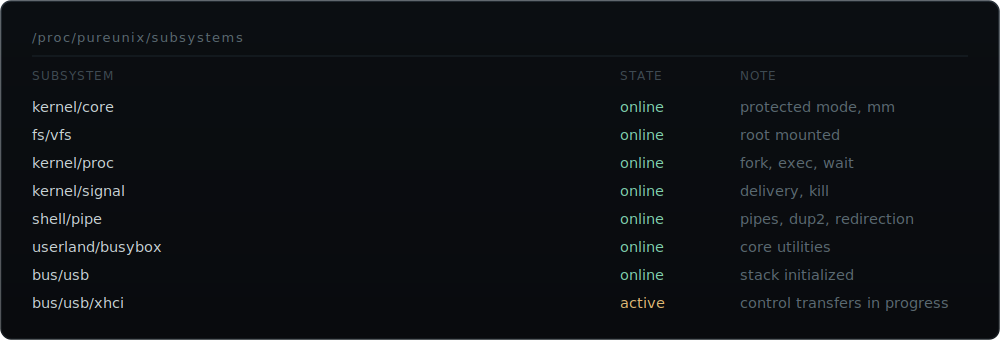
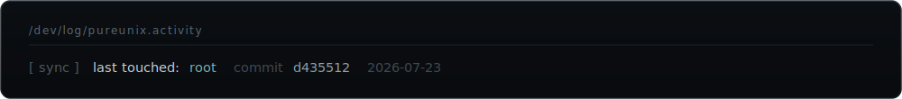

 

**Vihaan Nathan** — 14 — systems programmer building **PureUNIX**, a Unix-like operating system from scratch: kernel, process management, syscalls, VFS, signals, a BusyBox userland, and a USB/xHCI stack, in C and x86 assembly.

 

  

 

C · x86 asm · C++ · QEMU · Git · GNU toolchain

