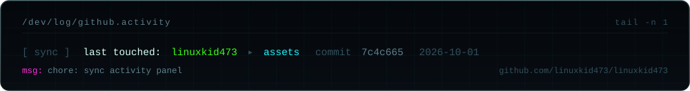

<div align="center">



</div>

<br />

i'm vihaan — 14, systems programmer. i write the parts of computing most people never look at: kernels, syscalls, schedulers, signals, bootloaders, emulators. C and x86-64 assembly, from scratch, no frameworks.

<br />

<div align="center">



<br /><br />



</div>

<br />

<div align="center">

```text
╔═[ 0x01 ]══════════════════════ projects ═══════════════════════╗
```

</div>

| project | what it is |
| --- | --- |
| **[PureUNIX](https://github.com/linuxkid473/PureUNIX)** | unix-like OS from scratch — kernel, VFS, process management, syscalls, signals, pipes, a BusyBox userland and a USB/xHCI stack, in C and x86 asm |
| **[AsterOS](https://github.com/linuxkid473/AsterOS)** | a Darwin/XNU-based operating system |
| **[maclator](https://github.com/linuxkid473/maclator)** | run arm64 macOS apps on intel macs — reverse-Rosetta: interpreter, x86-64 JIT, AOT cache, and a Metal bridge to the host GPU |
| **[ppcosxkvm](https://github.com/linuxkid473/ppcosxkvm)** | PowerPC Mac OS X Tiger on apple silicon with an emulated ATI Radeon 9700 PRO — Quartz Extreme, Core Image and OpenGL through Metal |
| **[OptiPlex780-RX640-Hackintosh](https://github.com/linuxkid473/OptiPlex780-RX640-Hackintosh)** | a legacy-BIOS Core 2 Duo box running macOS Monterey with full Metal acceleration via OpenCore/OpenDuet |
| **[SiMPLE-OS](https://github.com/linuxkid473/SiMPLE-OS)** | built from scratch because using an OS was too easy |
| **[moon.github.io](https://github.com/linuxkid473/moon.github.io)** | an Apple-HIG-inspired portal for 160+ free browser games |

<br />

<div align="center">

```text
╔═[ 0x02 ]══════════════════════ activity ═══════════════════════╗
```



</div>
<div align="center">

```text
╔═[ 0x03 ]════════════════════════ reach ════════════════════════╗
```


<br />

[`github/linuxkid473`](https://github.com/linuxkid473) &nbsp;·&nbsp; [`pureunix`](https://github.com/linuxkid473/PureUNIX) &nbsp;·&nbsp; [`asteros`](https://github.com/linuxkid473/AsterOS) &nbsp;·&nbsp; [`maclator`](https://github.com/linuxkid473/maclator) &nbsp;·&nbsp; [`ppcosxkvm`](https://github.com/linuxkid473/ppcosxkvm)

<br /><br />

<sub>C · x86-64 asm · C++ · Bash · QEMU · GNU toolchain · Metal · OpenCore</sub>

<br /><br />

<sub><code>if it boots, it's honest</code></sub>

</div>
